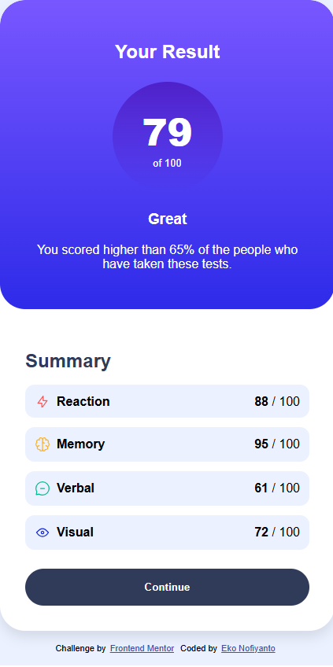

# Frontend Mentor - Results Summary Component

This is a solution to the [Results summary component challenge](https://www.frontendmentor.io/challenges/results-summary-component-CE_K6s0maV) on Frontend Mentor.  
Frontend Mentor challenges help you improve your coding skills by building realistic projects.  

## Table of contents

- [Overview](#overview)
  - [The challenge](#the-challenge)
  - [Screenshot](#screenshot)
  - [Links](#links)
- [My process](#my-process)
  - [Built with](#built-with)
  - [What I learned](#what-i-learned)
  - [Continued development](#continued-development)
- [Author](#author)

---

## Overview

### The challenge

Users should be able to:

- View the optimal layout for the component depending on their device's screen size  
- See hover and focus states for all interactive elements  
- Dynamically render scores from a JSON file  
- Calculate the overall average score automatically  

---

### Screenshot

#### Desktop


#### Mobile


---

### Links

- **Solution URL**: [GitHub Repo](https://github.com/ekonof23/results-summary-component)  
- **Live Site URL**: [Live Demo](https://ekonof23.github.io/results-summary-component/)  

---

## My process

### Built with

- Semantic **HTML5** markup  
- **CSS Flexbox** for layout  
- **Vanilla JavaScript** for DOM manipulation  
- **Fetch API** to load JSON data  
- Responsive design principles  

---

### What I learned

- How to fetch and render data dynamically from a JSON file  
- How to calculate and display an average score automatically  
- Structuring a responsive layout using Flexbox  

```js
// Example snippet from my solution
const response = await fetch("data.json");
const data = await response.json();
const average = Math.round(
  data.reduce((sum, item) => sum + item.score, 0) / data.length
);
